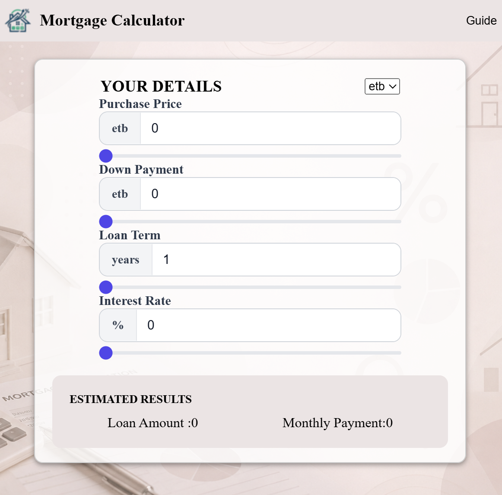

# Mortgage Calculator App

A modern, fast, and responsive Mortgage Calculator Web App built with **React** and **Vite**. 

This application allows users to instantly calculate monthly mortgage payments by adjusting the loan amount, interest rate, and loan term. It provides a seamless user experience with real-time feedback.

---

## Features

*  Instant Calculation: Get monthly mortgage payments as soon as you input data.
* Real-time Updates: Results update dynamically as you adjust the sliders or input fields.
* Interactive Controls: Easily adjust the loan amount, interest rate, and duration.
* Responsive Design: Fully optimized for all screen sizes, from mobile to desktop.
* Fast Performance: Built with Vite for ultra-fast development and optimized production builds.
* Clean UI: Minimalist and intuitive user interface for a better user experience.

---

##  Tech Stack

* **Framework:** [React.js](https://reactjs.org/)
* **Build Tool:** [Vite](https://vitejs.dev/)
* **Language:** JavaScript (ES6+)
* **Styling:** CSS3
## Preview

## deployed
https://mort-gage-4yqn.vercel.app/
